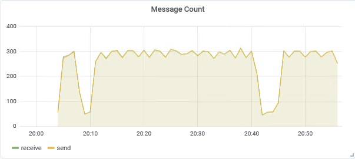
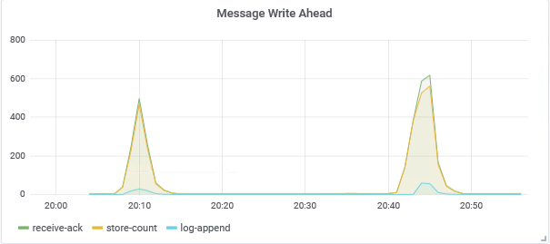
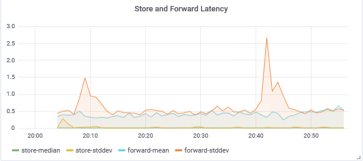

# IoT Edge Metrics

This repo contains containers that can be used for monitoring Windows Edge Metrics using Grafana and InfluxDB on the edge.

### Build using Azure Pipelines

[](https://dascholl.visualstudio.com/IoT/_build/latest?definitionId=44&branchName=master)


## Supported platforms 
Windows amd64


## Enable Metrics on the Edge
Metrics are enabled using the following methods found in [edge docs](https://github.com/Azure/iotedge/blob/master/doc/Metrics.md)


Edge Hub has the ability to automatically send metrics information to an Influx TimeSeries Database that is on the same network as the edgeHub module by setting the CollectMetrics environment variable in the EdgeHub module to `true`


```json
"edgeHub": {
    "type": "docker",
    "status": "running",
    "restartPolicy": "always",
    "settings": {
        "image": "mcr.microsoft.com/azureiotedge-hub:1.0.8",
        "createOptions": "{\"HostConfig\":{\"PortBindings\":{\"443/tcp\":[{\"HostPort\":\"443\"}],\"5671/tcp\":[{\"HostPort\":\"5671\"}],\"8883/tcp\":[{\"HostPort\":\"8883\"}]}}}"
    },
    "env": {
        "CollectMetrics": {
            "value": "true"
        }
    }
}
```

An [InfluxDB](https://www.influxdata.com/) can easily be brought online by deploying one as Edge Module.

```json
 "influxdb": {
    "settings": {
        "image": "danielscholl/influxdb:windows-1.0.0",
        "createOptions": ""
    },
    "type": "docker",
    "version": "1.0",
    "status": "running",
    "restartPolicy": "always"
}
```

These metrics can now be easily graphed and viewed by [Grafana](https://grafana.com/) also deployed as an Edge Module.

```json
"grafana": {
    "settings": {
        "image": "danielscholl/grafana:windows-1.0.0",
        "createOptions": "{\"ExposedPorts\":{\"8080/tcp\":{}},\"HostConfig\":{\"PortBindings\":{\"8080/tcp\":[{\"HostPort\":\"8080\"}]}}}"
    },
    "type": "docker",
    "status": "running",
    "restartPolicy": "always",
    "version": "1.0"
}
```

## Viewing Edge Metrics
Metrics are available directly on the Edge Device itself.  `http://<edge_ip_address>:8080`

The default dashboard contains the following panels

1. Message Tracking

   Displays the total number of messages stored and drained from the internal queue.

   ```sql
    SELECT sum("value") FROM "autogen"."application__endpointmessagestoredcount" WHERE $timeFilter GROUP BY time(1m) fill(null)

    SELECT sum("value") FROM "autogen"."application__endpointmessagedrainedcount" WHERE $timeFilter GROUP BY time(1m) fill(null)
   ```
   

2. Message Count

   Displays the total number of messages received and sent to the cloud.

   ```sql
    SELECT sum("value") FROM "autogen"."application__edgehubmessagereceivedcount" WHERE $timeFilter GROUP BY time(1m) fill(null)

    SELECT sum("value") FROM "autogen"."application__edgehubtocloudmessagesentcount" WHERE $timeFilter GROUP BY time(1m) fill(null)
   ```
   

3. Message Latency

    Displays the latency incurred sending messages to the cloud.

    ```sql
    SELECT mean("p99") FROM "autogen"."application__edgehubtocloudmessagelatencyms" WHERE ("unit_dur" = 'ms') AND $timeFilter GROUP BY time(1m) fill(null)

    SELECT mean("max") FROM "autogen"."application__edgehubtocloudmessagelatencyms" WHERE ("unit_dur" = 'ms') AND $timeFilter GROUP BY time(1m) fill(null)

    SELECT mean("median") FROM "autogen"."application__edgehubtocloudmessagelatencyms" WHERE ("unit_dur" = 'ms') AND $timeFilter GROUP BY time(1m) fill(null)

    SELECT mean("stddev") FROM "autogen"."application__edgehubtocloudmessagelatencyms" WHERE ("unit_dur" = 'ms') AND $timeFilter GROUP BY time(1m) fill(null)
    ```
    

4. Message Write Ahead Latency

   Displays the latency incurred from message received to updating the count and appending to the log.

   ```sql
    SELECT mean("mean") FROM "autogen"."application__endpointmessagestoredlatencyms" WHERE ("unit_dur" = 'ms') AND $timeFilter GROUP BY time(1m) fill(null)

    SELECT mean("mean") FROM "autogen"."application__messageentitystoreputorupdatelatencyms" WHERE ("unit_dur" = 'ms') AND $timeFilter GROUP BY time(1m) fill(null)

    SELECT mean("mean") FROM "autogen"."application__sequentialstoreappendlatencyms" WHERE ("unit_dur" = 'ms') AND $timeFilter GROUP BY time(1m) fill(null)
   ```
   

5. Store and Forward Latency

   Displays the time to write and read messages from the store and forward database.

   ```sql
    SELECT mean("median") FROM "autogen"."application__dbputlatencyms" WHERE ("unit_dur" = 'ms') AND $timeFilter GROUP BY time(1m) fill(null)

    SELECT mean("stddev") FROM "autogen"."application__dbputlatencyms" WHERE ("unit_dur" = 'ms') AND $timeFilter GROUP BY time(1m) fill(null)

    SELECT mean("median") FROM "autogen"."application__dbgetlatencyms" WHERE ("unit_dur" = 'ms') AND $timeFilter GROUP BY time(1m) fill(null)

    SELECT mean("stddev") FROM "autogen"."application__dbgetlatencyms" WHERE ("unit_dur" = 'ms') AND $timeFilter GROUP BY time(1m) fill(null)
   ```
   
